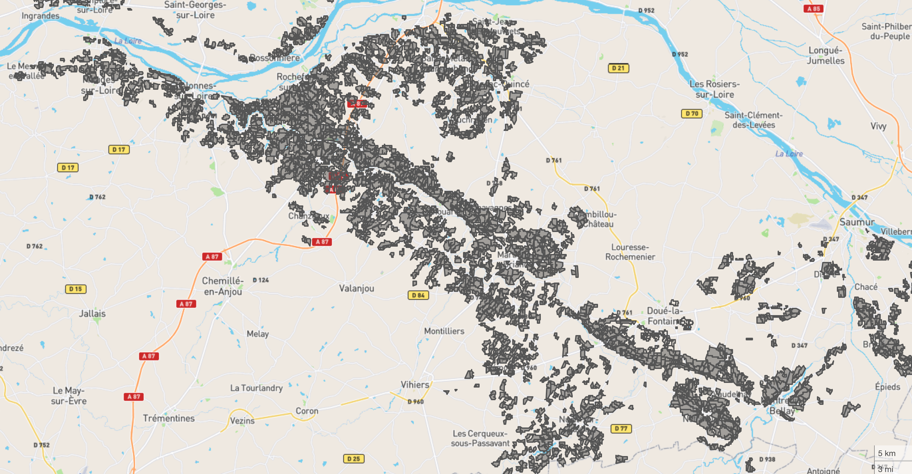
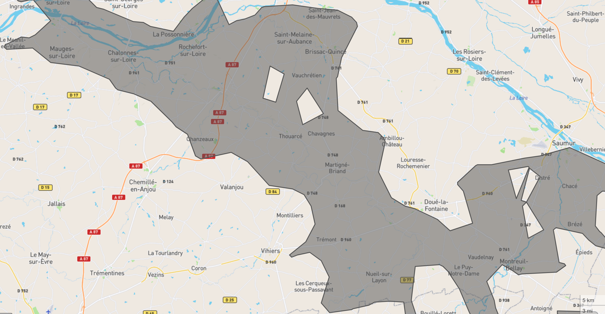

# merge-polygons
https://www.npmjs.com/package/merge-polygons

Merge non continuous geojson polygons into multiples concave polygons based on polygons distance.





## Usage

### Command
```bash
npx merge-polygons -i input.geojson -o output.geojson --maxDistance 4 --maxEdge 6 --units 'kilometers'
```
```
Options :
  -i, --input        Input path of geojson file [string] [requis]
  -o, --output       Output path of geojson file [string] [default : "output.geojson"]
  -d, --maxDistance  distance in kilometers to consider polygons belonging to
                     the same group [number] [default : 4]
  -e, --maxEdge      the length (in 'units') of an edge necessary for part of
                     the hull to become concave. Cannot be lower than
                     maxDistance + 1. [number] [default : 5]
  -u, --units        can be degrees, radians, miles, or kilometers [string] [default : "kilometers"]
  -h, --help         Display help [booléen]
```

### Install
```bash
npm -i merge-polygons
```

### Require

```javascript
const { mergePolygonsByDistance } = require('merge-polygons');

const geoResult = await mergePolygonsByDistance(geoInput, { maxDistance: 5, units: 'kilometers', maxEdge: 6 });
```

## Tips
To improve performance, simplify your geometry before execute merge polygons. Use dissolve function, and simplify. Example with `mapshaper` and `turf`:
```javascript
const { 'result.geojson': buffer } = await mapshaper.applyCommands(`${path} -dissolve2 gap-fill-area=5km2 -o result.geojson`);
let result = JSON.parse(buffer.toString());
result = turf.simplify(result, { tolerance: 0.001, highQuality: false, mutate: true });

const geoResult = await mergePolygonsByDistance(result, { maxDistance: 5, units: 'kilometers', maxEdge: 6 });
```
